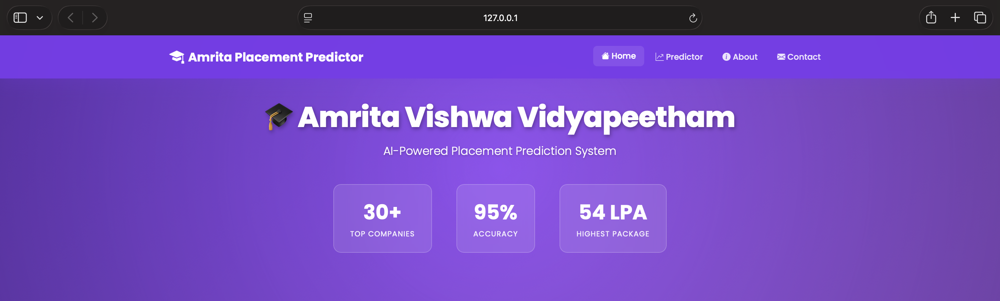
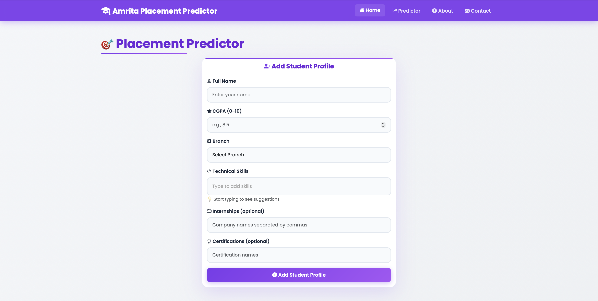
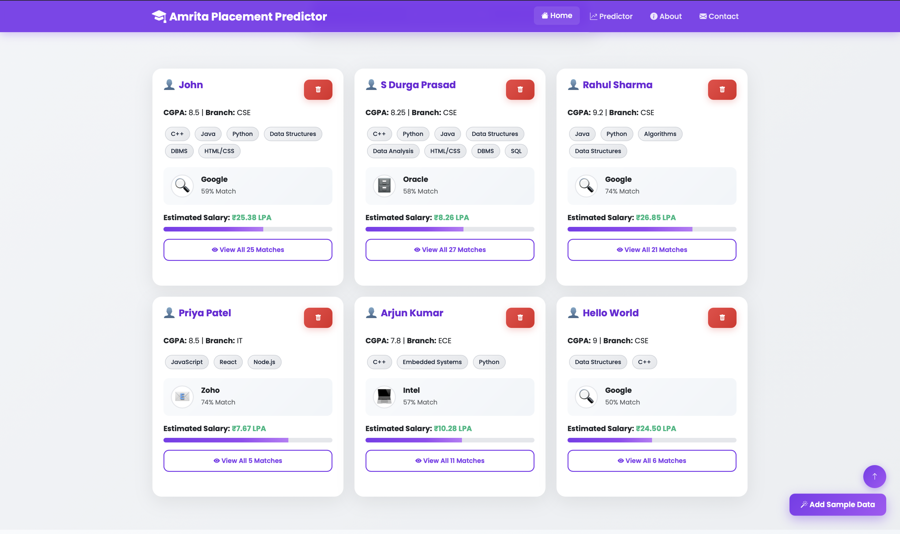

# 🎓 Student Placement Prediction System

A full-stack web application that predicts student placement chances and expected salary (LPA) based on academic performance and skills.

## 📌 Features
- Predicts **placement probability** using CGPA and skills
- Estimates **expected salary (LPA)**
- Matches students with **30+ top recruiting companies**
- Uses **CSV dataset** for historical academic records
- Performs **data analysis using Pandas**
- Interactive and responsive **web-based UI**

## 🛠️ Tech Stack
- **Frontend:** HTML, CSS, JavaScript, Bootstrap  
- **Backend:** Python, Flask  
- **Data Analysis:** Pandas  
- **Dataset:** CSV  
- **Tools:** VS Code, GitHub  

## 📈 Data Analysis
- Used Pandas to analyze historical academic data
- Placement probability calculated from similar CGPA ranges
- Expected LPA estimated using mean salary trends
- Dataset stored in CSV format

## 📊 How It Works
1. User enters student details (CGPA, branch, skills, internships, certifications)
2. Frontend sends data to Flask backend via REST API
3. Backend analyzes historical academic data using Pandas
4. Placement probability and expected LPA are calculated
5. Results are returned and displayed on the UI

## How to Run the Project

```bash
### 1. Clone the repository
git clone https://github.com/DurgaPrasad-1805/Student-Placement-Prediction.git
cd student-placement-prediction

### 2. Install dependencies
python3 -m pip install -r requirements.txt

### 3. Run the Flask application
python3 app.py

### 4. Open in Browser
```

---

## 🖼️ Screenshots

### 🏠 Home Page


### ➕ Add Student Profile


### 📊 Placement Prediction


---

## 👨‍💻 Author
Somepalli Durga Prasad <br>
B.Tech – Computer Science Engineering <br>
Amrita Vishwa Vidyapeetham, Chennai
